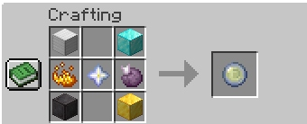

# 👑 Kingdoms of Origin: The Official Guide

Welcome to the **Kingdoms of Origin** server. This isn't just a survival world — it's a living history shaped by its players, its rulers, and the divine powers granted by the stars.

---

## 📋 Table of Contents

1. [🌍 The World: A Grand Scale](#the-world-a-grand-scale)
2. [👑 The King's Origin](#the-kings-origin)
3. [🗳️ The Election Cycle](#the-election-cycle)
4. [🧬 The Origins System](#the-origins-system)
   - [🌟 Your Awakening](#your-awakening)
   - [🔄 Seamless Transitions](#seamless-origin-transitions)
   - [🔮 The Fall & The Orb](#the-fall--the-orb)
5. [📜 Royal Perks & Policies](#royal-perks--policies)
6. [💰 Treasury, Crowns, Taxes, and Revolts](#treasury-crowns-taxes-and-revolts)
7. [🖥️ Server Integration](#rich-server-integration)
8. [⌨️ Command Reference](#command-reference)
9. [🧩 Mods](#mods)
10. [⚒️ Orb of Origin — Crafting Recipe](#orb-of-origin--crafting-recipe)
11. [📦 Required Mods & Installation](#required-mods--installation)
12. [🛠️ Server Administrator Guide](#server-administrator-guide)
13. [🚧 Known Limitations / Roadmap](#known-limitations--roadmap)

---

## 🌍 The World: A Grand Scale

Our world is a meticulously crafted **1:4500 scale recreation of the Earth**. Every continent, mountain range, and river exists at a scale that allows for true nation-building and strategic expansion. Whether you settle in the heart of Europe or the vast plains of the Americas, your surroundings are part of a global stage.

---

## 👑 The King's Origin

The ultimate power on the server is **The King** origin.

- **Ascension:** Through the democratic election process (or interim appointment), one player is crowned King.
- **The Power:** Upon coronation, you are bestowed with **The King** origin, granting you god-like strength and control over your domain.
- **The Burden:** This power is temporary. Your reign is tied to your term in office.

### ⚡ Detailed Divine Powers
When a player is crowned King, they are granted incredible abilities to enforce their rule, balanced with severe weaknesses:

- 👑 **Royal Decree (Primary Active):** Rally your subjects! Issue a command that grants Strength II and Resistance I to all players within 15 blocks for 15 seconds (60s Cooldown).
- ⚡ **Wrath of the King (Secondary Active):** Call down a devastating bolt of lightning on whatever block or entity you are looking at up to 30 blocks away (30s Cooldown).
- 💥 **Iron Fist (Passive):** Strike with the weight of your realm (+3 Attack Damage).
- 🛡️ **Crown's Resilience (Passive):** Fortified by the burden of the crown (+10 Max Health, +4 Armor, +2 Armor Toughness).
- 🏃 **Sovereign's March (Passive):** Never slow to act (+15% Movement Speed).
- 🪽 **Divine Flight (Passive):** Take to the skies to survey your domain using creative flight.

### ⚖️ The King's Drawbacks
- ✨ **Royal Radiance:** The crown marks you. All can see where you stand (Permanent Glowing effect).
- 👁️ **Undeniable Presence:** A king cannot hide from his people or enemies (Immunity to Invisibility potions).
- 🎯 **Mark of the Crown:** Enemies are drawn to power (Reduced Knockback Resistance).
- 🤲 **Soft Hands:** Accustomed to ruling, not manual labor (-30% Mining Speed).
- 🏹 **Prime Target:** An undeniable presence makes you an easy mark (+50% Projectile Damage Taken).
- 🌑 **Creature of Light:** Your sovereign power is tied to the light. In darkness, your max health is halved, you take +50% more damage, and suffer from crippling Weakness, Slowness, and Mining Fatigue.

---

## 🗳️ The Election Cycle

The core of the mod is the democratic process. Elections happen automatically based on configurable term limits (default: 7 real-world days).

- **Interim King:** When a server first starts, the first player to join is granted the King origin as an interim ruler. They hold this power until they initiate the first election.
- **Nomination Phase:** Players use `/kingdom run [slogan]` to declare their candidacy.
- **Campaign Phase:** A period for candidates to rally support and make promises to the server.
- **Voting Phase:** Players use `/kingdom vote` to securely and anonymously cast their ballot via an interactive GUI.
- **Coronation:** Once voting concludes, the winner is automatically crowned!

---

## 🧬 The Origins System

In this realm, you are born with a legacy. Unlike standard servers, your path is defined by the stars from the moment you arrive.

### 🌟 Your Awakening

When you first join the server, you do not choose your identity. Instead, you are **granted an origin** by the server. This initial origin defines your early survival, granting you unique strengths and weaknesses that you must master to survive the 1:4500 world.

### 🔄 Seamless Transitions
The mod integrates perfectly with your existing Origins.
- **Layer Mode (Recommended):** The King origin is added as a secondary "layer" on top of your primary origin. You keep your base powers, and gain the King's powers. When your term ends, the King layer is simply removed.
- **Replace Mode:** The King origin completely replaces your current origin. When your term is up, your original origin is safely restored!

### 🔮 The Fall & The Orb

When your reign ends — whether through election, abdication, or forced removal — the divine power of the crown leaves you.

- **The Gift:** Upon losing the King origin, you are granted an **Orb of Origin**.
- **Reshaping Destiny:** You can use this Orb to finally **pick** the origin you desire, allowing you to transition from a ruler back into a specialized member of society.

---

## 📜 Royal Perks & Policies

The King can enact server-side policies that feel like government decrees instead of flat stat modifiers. Policies trigger from gameplay events such as mining ore, harvesting crops, fighting mobs, sleeping, eating, taking damage, or moving through the world.

Policies are selected through a chest GUI from the ruler panel or with `/kingdom setperks <ids...>`. Any player can view active policies with `/kingdom perks`, and candidates can promise policies before an election with `/kingdom promise <ids...>`.

### Policy Budget
- Each term starts with **20 Policy Points**.
- Minor policies cost **2** points.
- Moderate policies cost **4** points.
- Strong policies cost **6** points.
- Debuff policies refund **3** points.
- Corruption policies cost **0** points.
- Only **one policy per category** may be active at a time.
- The five categories are **Labor**, **Military**, **Economic**, **Social**, and **Corruption**.

### Promise vs. Reality
Candidates can declare policy promises before an election. When the winning ruler enacts policies, the server compares the active policies against their promises:
- Honored promises increase the ruler's trust score.
- Broken promises reduce the ruler's trust score.
- Each broken promise is broadcast publicly.
- `/kingdom trust` shows the current ruler's score and recent promise history.
- `/kingdom ruler` also displays the current ruler's trust score.

### Policy Categories

#### Labor
- **Iron Mandate** (`iron_mandate`): By royal order, every mined iron or copper ore has a one-in-three chance to drop an extra raw ore.
- **Stone Covenant** (`stone_covenant`): The crown blesses public works: breaking stone below Y=32 grants Haste I for 12 seconds.
- **Breadline** (`breadline`): The granaries open: harvesting fully grown wheat, carrots, potatoes, or beetroot restores 1 hunger once every 20 seconds.
- **Charcoal Charter** (`charcoal_charter`): The forests serve the realm: chopping logs has a one-in-four chance to drop charcoal.
- **Deep Levy** (`deep_levy`): The mines are mobilized: breaking deepslate ores grants Haste II for 10 seconds and 1 experience point.
- **Green Commons** (`green_commons`): The commons are protected: breaking leaves has a one-in-five chance to return a matching sapling or apple.
- **Canal Act** (`canal_act`): State canals speed labor: mining or harvesting while wet grants Dolphin's Grace for 8 seconds.
- **Granary Audit** (`granary_audit`): The crown audits every harvest: crop harvesting sometimes withholds the bonus yield and refunds 3 Policy Points.
- **Timber Quota** (`timber_quota`): Royal quotas bite: every tenth log chopped drops two extra sticks and grants Haste II for 15 seconds.
- **Quarry Whistle** (`quarry_whistle`): When a miner breaks coal, redstone, or lapis ore, nearby subjects gain Haste I for 8 seconds.

#### Military
- **The People's Blade** (`peoples_blade`): Militia law is declared: after killing a hostile mob, gain Strength I for 10 seconds.
- **Shield Wall Decree** (`shield_wall_decree`): The guard holds formation: blocking damage grants Resistance I for 6 seconds.
- **Wolf Tax** (`wolf_tax`): Kennels are funded: killing a skeleton has a one-in-four chance to grant Speed I for 12 seconds.
- **Last Stand Clause** (`last_stand_clause`): No subject falls quietly: dropping below 5 hearts grants Resistance II for 8 seconds once per minute.
- **Monster Bounty** (`monster_bounty`): The treasury pays for safety: killing hostile mobs grants 1 extra experience.
- **Siege Rations** (`siege_rations`): Wartime rations begin: everyone gains Strength I after eating but loses 1 hunger immediately.
- **Blood Standard** (`blood_standard`): Wartime banners rise: everyone gains Strength I while below half health but has 2 fewer max hearts.
- **Powder Inspection** (`powder_inspection`): Explosives are regulated: creeper and TNT damage grants Fire Resistance and Resistance for 8 seconds.
- **Draft Notice** (`draft_notice`): The draft burdens all subjects: combat kills no longer trigger bounty XP and refund 3 Policy Points.
- **Border Watch** (`border_watch`): Watch posts report danger: being hit by a projectile grants Speed I for 8 seconds.

#### Economic
- **Guild Tithe** (`guild_tithe`): Guilds pay in kind: earning experience has a one-in-four chance to grant 1 extra experience.
- **Minted Overtime** (`minted_overtime`): The mint rewards long labor: every fifth ore broken grants 3 experience.
- **Market Day** (`market_day`): Market stalls open: trading with villagers grants Regeneration I for 8 seconds.
- **Salvage Rights** (`salvage_rights`): Nothing is wasted: killing armored mobs has a chance to drop an iron nugget.
- **Enchanter's License** (`enchanters_license`): Licensed scholars prosper: collecting an experience orb while near an enchanting table grants 2 bonus XP.
- **Public Ledger** (`public_ledger`): The ledgers are open: every new active policy announces its cost and remaining Policy Points.
- **Austerity Act** (`austerity_act`): Austerity is imposed: subjects lose 10 percent of earned experience and refund 3 Policy Points.
- **Blacksmith Contract** (`blacksmith_contract`): The forges work for the realm: mining iron while holding a damaged tool repairs it by 1 durability.
- **Fisher Auction** (`fisher_auction`): Dock auctions are sanctioned: catching fish grants Luck I for 12 seconds.
- **War Bonds** (`war_bonds`): Wartime bonds sell fast: everyone gains 25 percent bonus XP from combat but takes 10 percent more damage.

#### Social
- **Open Roads Act** (`open_roads`): The highways are cleared: sprinting on roads, stone, or planks grants Speed I.
- **Public Clinic** (`public_clinic`): The clinics open: sleeping or respawning grants Regeneration II for 15 seconds.
- **Festival Law** (`festival_law`): The realm celebrates: eating sweet food grants Jump Boost I for 12 seconds.
- **Safe Lodging** (`safe_lodging`): Inns receive funding: entering a bed clears Poison and Hunger.
- **Courier Network** (`courier_network`): Royal couriers ride: after traveling 300 blocks, gain Speed II for 20 seconds.
- **Night School** (`night_school`): Night schools convene: after sunset, subjects gain Night Vision while outdoors.
- **Bread and Circuses** (`bread_and_circuses`): Wartime pageantry begins: everyone gains Speed II, but max health is reduced by 2 hearts.
- **Ration Cards** (`ration_cards`): Rations are tightened: natural regeneration is slowed by Hunger I and refund 3 Policy Points.
- **Civil Service** (`civil_service`): Helpful clerks reduce friction: opening the policy viewer shows the king's trust and current promises.
- **Stone Shelters** (`stone_shelters`): Public shelters stand ready: taking fall damage grants Resistance I for 8 seconds.

#### Corruption
Corruption policies are asymmetric: the king gains personal power while subjects pay the cost. They cost 0 Policy Points, but promise breaks and public reaction can damage trust.
- **Crown Tax** (`crown_tax`): The king claims first profit: the king gains 40 percent bonus XP while subjects lose 15 percent XP.
- **Velvet Gaol** (`velvet_gaol`): The palace is secure: the king receives Resistance II while subjects suffer Mining Fatigue I.
- **Royal Physician** (`royal_physician`): Court physicians serve one patient: the king receives Regeneration II while subjects cannot skip night.
- **Private Armory** (`private_armory`): The royal armory closes to the public: the king gains Strength II while subjects suffer Weakness I.
- **Silken Roads** (`silken_roads`): The roads bend toward the palace: the king gains Speed II while subjects suffer Slowness I.
- **Dragon Seal** (`dragon_seal`): Forbidden seals protect the throne: the king gains Fire Resistance and subjects take 10 percent more damage.

---

## 💰 Treasury, Crowns, Taxes, and Revolts

### Reserves and Crowns
Crowns are the kingdom's state currency. They are backed only by diamonds and diamond blocks held in the treasury.
- **Reserve value** = raw diamonds + diamond blocks x 9.
- **Reserve ratio** = reserve value divided by Crown supply.
- If the King mints more Crowns than the reserve can support, the currency becomes strained, debased, or insolvent.
- Players can try to redeem Crowns for diamonds with `/kingdom treasury redeem <amount>`.
- If redemption fails because reserves are empty, legitimacy drops sharply and unrest rises publicly.

| State | Meaning |
|---|---|
| Fully Backed | Crown supply is fully covered by diamond reserves. Legitimacy improves and unrest cools. |
| Stable | The treasury is healthy but not fully covered. Minor positive stability. |
| Strained | Backing is thin. The public receives warnings and unrest starts rising. |
| Debased | The currency is visibly overprinted. Legitimacy falls and unrest rises quickly. |
| Insolvent | Crowns cannot be trusted. Failed redemption and revolt risk become likely. |

### Taxes
The King controls four tax channels:
| Tax | Default/Cap | Collection |
|---|---:|---|
| XP tax | 0% (Cap 30%) | Collected from server-side bonus XP events used by kingdom policies. |
| Trade tax | 0% (Cap 30%) | Collected when subjects interact with villagers. |
| Resource tithe | 0% (Cap 30%) | Collected from diamond ore and deepslate diamond ore breaks. |
| Emergency levy | 0% (Cap 50%) | A political emergency tax setting; high rates add heat and unrest. |

### Spending Categories
Public categories reduce unrest or improve legitimacy:
- `public_works`: Public legitimacy gain and modest unrest reduction.
- `military`: Funds defense; minor order benefit but slightly increases heat.
- `relief`: Strong welfare spending that cuts unrest.
- `infrastructure`: Improves legitimacy and lowers unrest.
- `festival`: Morale spending that cools unrest.
- `stabilization`: Expensive crisis response with the strongest unrest reduction.

Private/corrupt categories:
- `palace`: Royal household spending. Gives private value but raises heat and unrest.
- `siphon`: Direct private extraction. Strong corruption and unrest spike.

### Stability Values
The mod tracks four separate political values:
- **Trust:** Promise keeping, stored separately from elections and policy promises.
- **Legitimacy:** Whether the King is seen as rightful and competent. Reserves, spending, and scandals affect it.
- **Corruption Heat:** How visible and aggressive fiscal abuse has become.
- **Unrest:** How close the realm is to open revolt. At high unrest, the revolt window opens.

### Revolt and Overthrow
A King is never removed automatically for low popularity alone. Removal happens through a physical popular revolt. When unrest reaches the revolt threshold, a **Revolt Window** opens.
- A revolt boss bar appears and a server announcement is made.
- Players join rebels with `/kingdom revolt join` or defenders with `/kingdom revolt defend`.
- Rebels must capture the capital objective (Default: **0 64 0**).
- Capture progresses only if rebels outnumber loyalists inside the capital zone.
- At the capture target, the King is removed immediately, powers revoked, treasury frozen, and a snap election starts.

---

## 🖥️ Rich Server Integration
- **GUI Menus:** Beautiful, easy-to-use in-game menus (`/kingdom menu`) to view candidates, vote, and see election status.
- **Live Announcements:** Boss bars and scoreboard updates keep everyone informed about ongoing elections.
- **Map Support:** Integrates with BlueMap and Dynmap to highlight the Capital and the current ruler's domain.

---

## ⌨️ Command Reference

### Player Commands
| Command | Description |
|---|---|
| `/kingdom status` | Show current ruler, term end, and election phase. |
| `/kingdom start-election` | Start a new election cycle (King only). |
| `/kingdom ruler` | Show current ruler's name, term details, and active perks. |
| `/kingdom candidates` | List candidates in the current election. |
| `/kingdom run [slogan]` | Register yourself as a candidate (nomination phase only). |
| `/kingdom promise <perks...>` | Declare your campaign promises (comma-separated IDs). |
| `/kingdom setperks <perks...>` | Set the active policies for the server (King only). |
| `/kingdom perks` | Open a read-only GUI showing active policies. |
| `/kingdom trust` | View the current ruler's trust score and history. |
| `/kingdom treasury` | View reserves, Crown supply, taxes, and stability. |
| `/kingdom treasury gui` | Open the treasury GUI. |
| `/kingdom treasury deposit <d> <b>` | Deposit diamonds/blocks into the reserve. |
| `/kingdom treasury redeem <amt>` | Redeem Crowns for diamonds. |
| `/kingdom revolt` | View revolt status and capture progress. |
| `/kingdom menu` | Open the main kingdom GUI. |

---

## ⚒️ Orb of Origin — Crafting Recipe

The Orb of Origin lets you **reset and re-select your origin**.

---

## 🧩 Mods

> ⚠️ **All mods are required.** The server will not function correctly if any mod is missing.

### 🧬 [Origins](https://modrinth.com/mod/origins)
The core mod powering the entire origins system. Each player is assigned a unique origin with its own powers, buffs, and drawbacks — shaping how you interact with the world from the moment you spawn.

### ⚡ [Origins++](https://modrinth.com/mod/origins-plus-plus)
A massive expansion to the base Origins mod, adding **100+ new origins** with unique mechanics, custom resource bars, and multi-ability kits far beyond what vanilla Origins offers.

### 🌿 [Extra Origins](https://modrinth.com/mod/extra-origins)
Adds 5 additional focused origins including plant-based, fungal, and radioactive playstyles. Requires the [Pehkui](https://modrinth.com/mod/pehkui) mod to function.

### 👾 [Mob Origins](https://modrinth.com/mod/mob-origins)
Adds origins directly inspired by vanilla Minecraft mobs — play as a Bee, Creeper, Zombie, Spider, Phantom, and more, each with mechanics that mirror their mob counterpart.

### 🎙️ [Simple Voice Chat](https://modrinth.com/plugin/simple-voice-chat)
Adds real-time **proximity-based voice chat** to the server. Players can hear each other based on distance, with support for group channels. Press **`V`** to open settings; default push-to-talk is **CAPS LOCK**.

### 🗺️ [Dynmap](https://modrinth.com/plugin/dynmap)
A live, browser-accessible map of the entire server world. See online players, player-built structures, and world geography in real time — accessible via the server IP.

### 🚗 [Automobility](https://modrinth.com/mod/automobility)
Adds fully functional, buildable cars to the game. Craft parts at the **Auto Mechanic Table**, assemble them at the **Automobile Assembler**, and drive with `W` / `S` / `Space`.

### 🦎 [Alex's Mobs](https://modrinth.com/mod/alexs-mobs)
Adds **90+ new creatures** — from predators like Tigers and Orcas to giants like Cachalot Whales, and tameable companions like Raccoons and Capuchin Monkeys.

---

## 📦 Required Mods & Installation

To experience the full features of the Kingdom, you must install the following mods from the `/mods` folder.

1. Download all `.jar` files from the [mods folder](mods).
2. Place them into your local `.minecraft/mods` directory.
3. Ensure you are running **Fabric Loader 0.15.0+** for Minecraft **1.20.1**.
---

*Kingdoms of Origin — Admin & Maintainer: **Ali Sayed***